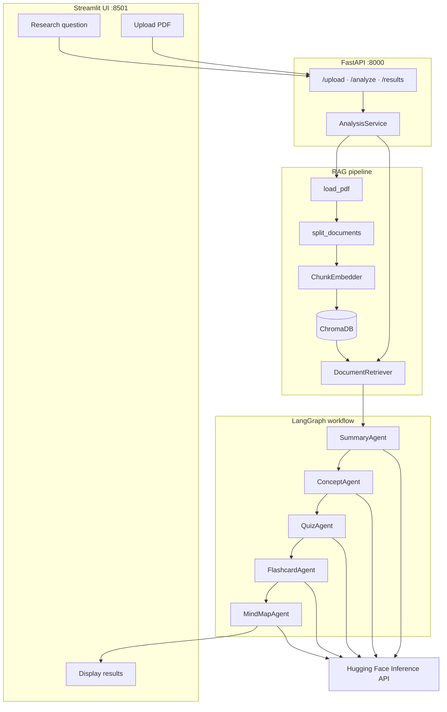
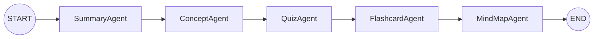

# Book Research Agent

[](https://github.com/Ricardo-Bortolotti/research-workflow-agent/actions/workflows/ci.yml)

AI-powered system that transforms books, articles, and PDFs into structured study materials using **Retrieval-Augmented Generation (RAG)** and a **LangGraph** multi-agent workflow.

Upload a PDF, ask a research question, and receive an executive summary, key concepts, quiz questions, flashcards, and a hierarchical mind map — all grounded in retrieved document chunks.

---

## Table of contents

- [Architecture](#architecture)
- [Agent workflow (DAG)](#agent-workflow-dag)
- [Tech stack](#tech-stack)
- [Project structure](#project-structure)
- [Quick start](#quick-start)
- [API examples](#api-examples)
- [Docker](#docker)
- [Testing & CI](#testing--ci)
- [Deployment](#deployment)
- [Notebooks](#notebooks)
- [Environment variables](#environment-variables)

---

## Architecture

The system follows a classic **RAG + agent orchestration** pattern: ingest a document, index it in a vector store, retrieve relevant context for a user question, then run specialized LLM agents over that context.



**Data flow**

1. **Upload** — PDF is saved under `data/metadata/uploads/`.
2. **Index** — Pages are loaded, chunked, embedded (`BAAI/bge-small-en-v1.5`), and stored in ChromaDB (`data/vector_db/`).
3. **Retrieve** — The user's question is embedded and matched against the top-*k* chunks.
4. **Analyze** — A linear LangGraph DAG runs five agents sequentially, each consuming the same retrieved context.
5. **Persist** — Structured JSON results are saved under `data/metadata/results/` and returned via the API.

---

## Agent workflow (DAG)

Agents run in a **fixed linear DAG** (no branching). Each node reads `question` + `context` from shared workflow state and writes its output back to state.



| Node | Output |
|------|--------|
| **SummaryAgent** | Executive summary + bullet key insights |
| **ConceptAgent** | JSON list: concept, definition, relevance |
| **QuizAgent** | JSON list: question, answer, difficulty |
| **FlashcardAgent** | JSON list: front / back pairs |
| **MindMapAgent** | Hierarchical JSON tree + `to_text()` renderer |

```python
from graph.workflow import run_workflow
from rag.embeddings import ChunkEmbedder
from rag.retriever import DocumentRetriever
from rag.vectorstore import ChromaVectorStore

store = ChromaVectorStore()
store.load_collection()
retriever = DocumentRetriever(vector_store=store, embedder=ChunkEmbedder())

context = retriever.invoke("What is the main contribution?")
result = run_workflow("What is the main contribution?", context)

print(result["summary"].executive_summary)
print(result["mindmap"].to_text())
```

---

## Tech stack

| Layer | Technology |
|-------|------------|
| **Language** | Python 3.11 |
| **Package manager** | [uv](https://github.com/astral-sh/uv) |
| **RAG** | LangChain, ChromaDB, sentence-transformers |
| **Embeddings** | `BAAI/bge-small-en-v1.5` |
| **Orchestration** | LangGraph |
| **LLM** | Hugging Face Inference API (`meta-llama/Llama-3.1-8B-Instruct` default) |
| **API** | FastAPI + Uvicorn |
| **UI** | Streamlit |
| **Containers** | Docker, docker-compose |
| **CI** | GitHub Actions (Ruff, pytest, Docker build) |
| **Testing** | pytest (mocked LLM / vector store — no API key required) |

---

## Project structure

```
book-research-agent/
├── app/              # FastAPI entrypoint, HuggingFaceLLM wrapper
├── agents/           # Summary, Concepts, Quiz, Flashcards, MindMap agents
├── api/              # Routes, schemas, service layer, file storage
├── graph/            # LangGraph state, nodes, workflow DAG
├── rag/              # Loaders, splitter, embeddings, vectorstore, retriever
├── ui/               # Streamlit frontend
├── tests/            # pytest unit & integration tests
├── notebooks/        # Interactive exploration notebooks
├── scripts/          # Manual test utilities
├── Dockerfile
├── docker-compose.yml
└── pyproject.toml
```

---

## Quick start

### Prerequisites

- Python 3.11+
- [uv](https://docs.astral.sh/uv/getting-started/installation/)
- Hugging Face API token with [Inference Providers](https://huggingface.co/settings/inference-providers) enabled

### Setup

```bash
git clone https://github.com/Ricardo-Bortolotti/research-workflow-agent.git
cd research-workflow-agent

uv sync
cp .env.example .env
# Edit .env — set HUGGINGFACE_API_TOKEN
```

### Run locally

**Terminal 1 — API**

```bash
uv run uvicorn app.main:app --reload
```

Open http://localhost:8000/docs

**Terminal 2 — Streamlit UI**

```bash
uv run streamlit run ui/streamlit_app.py
```

Open http://localhost:8501

Set `API_URL` in `.env` if the API is not on `http://localhost:8000`.

---

## API examples

### Health check

```bash
curl http://localhost:8000/health
```

### Upload a PDF

```bash
curl -X POST http://localhost:8000/upload \
  -F "file=@sample.pdf"
```

Response:

```json
{
  "upload_id": "a1b2c3d4-...",
  "filename": "sample.pdf",
  "message": "PDF uploaded successfully"
}
```

### Run analysis

```bash
curl -X POST http://localhost:8000/analyze \
  -H "Content-Type: application/json" \
  -d '{
    "upload_id": "a1b2c3d4-...",
    "question": "What are the key ideas in this document?"
  }'
```

Response:

```json
{
  "analysis_id": "e5f6g7h8-...",
  "status": "completed",
  "message": "Analysis completed successfully"
}
```

### Fetch results

```bash
curl http://localhost:8000/results/e5f6g7h8-...
```

Returns structured JSON with `summary`, `concepts`, `quiz`, `flashcards`, and `mindmap` sections.

| Method | Path | Description |
|--------|------|-------------|
| `GET` | `/health` | Service health |
| `POST` | `/upload` | Upload a PDF |
| `POST` | `/analyze` | Index document + run agent workflow |
| `GET` | `/results/{analysis_id}` | Fetch structured results |

---

## Docker

**Prerequisites:** Docker Desktop, `.env` with `HUGGINGFACE_API_TOKEN`.

```bash
cp .env.example .env
docker compose up --build
```

| Service | URL |
|---------|-----|
| API | http://localhost:8000/docs |
| Streamlit UI | http://localhost:8501 |

Stop: `docker compose down` · Reset volumes: `docker compose down -v`

| Design choice | Rationale |
|---------------|-----------|
| Single Dockerfile | Same image for API and UI; Railway reuses it for API-only deploy |
| `uv sync --frozen` | Reproducible installs from `uv.lock` |
| Optional `PRELOAD_EMBEDDINGS` build arg | Pre-download BGE model in prod; skip in CI for faster builds |
| Named volumes (`app_data`, `model_cache`) | Persist uploads, ChromaDB, and HF caches |
| `API_URL=http://api:8000` in compose | UI container reaches API over Docker network |

---

## Testing & CI

### Run tests locally

```bash
uv sync --dev
uv run pytest -v
```

Tests use mocks for the Hugging Face API and ChromaDB — **no API token required** for the test suite.

| Module | Test file | Coverage |
|--------|-----------|----------|
| PDF loader | `tests/test_loaders.py` | Valid PDF, missing file, bad extension, empty pages |
| Splitter | `tests/test_splitter.py` | Chunking, metadata, validation |
| Retriever | `tests/test_retriever.py` | Embedding + search, `top_k`, error handling |
| Agents | `tests/test_*_agent.py`, `tests/test_agents.py` | Per-agent parsing + shared contracts |
| Workflow | `tests/test_workflow.py` | DAG compilation and execution order |
| API | `tests/test_api.py` | Upload, analyze, results endpoints |

### Lint

```bash
uv run ruff check app agents api graph rag ui tests
uv run ruff format --check app agents api graph rag ui tests
```

### GitHub Actions

On every push/PR to `main`, the [CI workflow](.github/workflows/ci.yml) runs:

1. **Lint** — Ruff check + format
2. **Test** — `pytest` (108 tests)
3. **Docker build** — `docker build` with `PRELOAD_EMBEDDINGS=false`

---

## Deployment

### FastAPI on Railway

1. Connect the GitHub repo to [Railway](https://railway.app).
2. Railway detects the `Dockerfile` (default CMD runs uvicorn on `$PORT`).
3. Set environment variables:
   - `HUGGINGFACE_API_TOKEN`
   - `HF_MODEL_ID` (optional)
4. Mount a volume at `/app/data` to persist uploads and results.
5. Health check path: `/health`

### Streamlit on Streamlit Community Cloud

1. Deploy at [share.streamlit.io](https://share.streamlit.io).
2. Main file: `ui/streamlit_app.py`
3. In **Secrets**:

   ```toml
   API_URL = "https://your-railway-api.up.railway.app"
   ```

The UI only calls the API — no HF token is needed in Streamlit secrets.

---

## Notebooks

Interactive walkthroughs under `notebooks/`:

| Notebook | Topic |
|----------|-------|
| `01_test_rag_pipeline.ipynb` | Index PDF + similarity search |
| `02_test_llm.ipynb` | Hugging Face LLM |
| `03_test_summary_agent.ipynb` | Summary Agent |
| `04_test_concept_agent.ipynb` | Concept Agent |
| `05_test_quiz_agent.ipynb` | Quiz Agent |
| `06_test_flashcard_agent.ipynb` | Flashcard Agent |
| `07_test_mindmap_agent.ipynb` | Mind Map Agent |
| `08_test_workflow.ipynb` | Full LangGraph workflow |

---

## Environment variables

| Variable | Required | Description |
|----------|----------|-------------|
| `HUGGINGFACE_API_TOKEN` | Yes | HF token for Inference API |
| `HF_MODEL_ID` | No | Model ID (default: `meta-llama/Llama-3.1-8B-Instruct`) |
| `HF_INFERENCE_PROVIDER` | No | Force provider suffix (e.g. `groq`) |
| `API_URL` | No | Streamlit → API URL (default: `http://localhost:8000`) |

See [`.env.example`](.env.example) for a full template.

---

## License

MIT — see repository license file for details.
